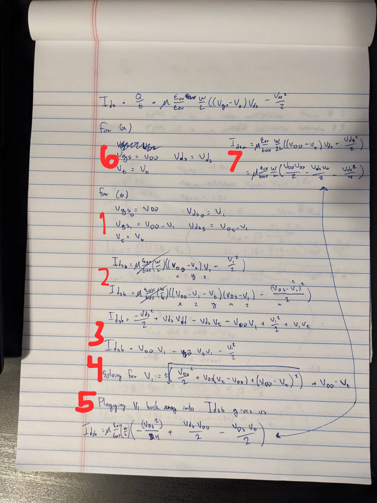

2. For this problem we'll make heavy use of the following defintion of $I_{ds}$:

   $$
   I_{ds} = \frac{Q}{T} \mu \frac{\epsilon_{ox}}{t_{ox}} \frac{W}{L} ((V_{gs} - V_t)V_{ds} - \frac{V_{ds}^2}{2})
   $$

   First, we'll solve for the currents in $I_{dsb}$. We'll denote the lower transistor as $V_gs0$ and the 
   upper transistor as $V_gs1$.

   I 100% ran out of time to put this into latex, so here's a picture of the work I did with a brief 
   explanation:

   

   1. Found transistor voltages for both (b) transistors 
   2. Set up $I$ for upper and lower transistors 
   3. Simplified equations 
   4. Solved for $V1$ 
   5. Plugged $V1$ back into $I_{dsb}$ for the lower transistor 
   6. Set up $I$ for (a) 
   7. Checked that the two were equal

   As a result, the currents are indeed equal.

3. $ V_{sb} $ for the upper transistor in (b) will be greater than 0, thus increasing 
   $V_t$ for that transistor. If we assume that $V_t$ increases by some small amount $a$ 
   and plug that result into the equation for $I_{ds2}$ from part 1, then we can see that 
   $I_{ds2}$ will actually decrease as $a$ increases. Therefore, when considering body 
   effect we can see that $I_{ds2}$ will be less than $I_{ds1}$.

   Also, transistor (a) and the lower transistor in (b) will not be effected as their 
   sources are grounded along with the body of the transistor.

6. We can use the equation we derived in class for calculating the effect that $V_{sb}$ 
   has on the threshold voltage to calculate this.

   $$
   V_t = V_{t0} + \gamma ( \sqrt{ \phi_s + V_{sb} } - \sqrt{ \phi_s } ) 
   $$

   First we can calculate $\phi_s$.

   $$
   \phi_s = 2 v_T l_n \frac{ NA }{ n_i }
   $$

   Doing some research online we can see that for room temperature $v_T = 26\text{mV}$ 
   and $n_i = 1.5\text{e}10$. Plugging in these numbers we get that

   $$
   \phi_s = 2 (26\text{e}-3) (0.6\text{e}-6) \frac{ 2\text{e}17 }{ 1.5\text{e}10 } = 0.416
   $$

   Now we need to solve for $\gamma$.

   $$
   \gamma = \frac{t_{ox}}{\epsilon_{ox}} \sqrt(2 q \epsilon_{si} N_A) 
   $$

   Plugging in values, $\epsilon_{ox} = \epsilon_{SiO2} = 3.9$, $\epsilon_{si} = 11.7$ and 
   $q = 1.6\text{e}-19$ we get that 

   $$
   \gamma = 2.2\text{e}-9 
   $$

   Now we can put it all together to see what the difference in our threshold voltage will be.

   $$
   V_{t0} = 2.2\text{e}-9 ( \sqrt{ 0.416 + 0 } - \sqrt{ 0.416 } ) = 0.7
   $$

   $$
   V_{t4} = 2.2\text{e}-9 ( \sqrt{ 0.416 + 4 } - \sqrt{ 0.416 } ) = 0.7
   $$

   Based of these results the change will be only 3.2 _nanovolts_! Now, I may have done a conversion
   incorrect somewhere, but in my notes and on the slides it appeared that all equations were just 
   in meters, volts, and other SI units. I tried changing some of the units (e.g. using Angstroms 
   instead of meters, etc.) and all this did was shift the decimal on the final result. So I settled 
   on 32nV for my answer as that did seem reasonable.

10. As temperature rises in an _ON_ transistor current will decrease. This is because as the temperature 
    gets higher the mobility decreases. As the mobility decreases so will the ability of the transistor 
    to generate current.

    As the temperature rises in an _OFF_ transistor current will increase! This may seem suprising 
    because I just said it would decrease, but now the transistor is in cutoff. Cutoff is when $V_{gs}$ 
    is less than $V_t$. The temperature rising decreases $V_t$, thus increasing the leakage current 
    at cutoff.

    Circuits operate better (faster) at lower temperatures because of the two points stated above. If 
    the current in the circuit is higher (as it is when cooler) then capacitances can be overcome in 
    the circuit faster. Also, if the threshold voltage is higher (as it is when it is cooler) then 
    transistions from high to low will occur faster and cleaner as well.

20. First we'll determine where each of the MOS circuits are operating. To do that we'll calculate all 
    values that we already know.

    $$ V_{gsp} = -V_{dd} $$

    $$ V_{dsp} = V_{out} - V_{dd} $$ 

    $$ V_{gsn} = V_{dd} $$
    
    $$ V_{dsn} = V_{out} $$

    Now we can apply the equations to determine if we are in saturation, linear, or cutoff 
    mode. 

    PMOS Equations:

    |    Cutoff    |       Linear        |      Saturated       |
    | :----------: | :-----------------: | :------------------: |
    | $Vgsp > Vtp$ |    $Vgsp < Vtp$     |    $ Vgsp < Vtp$     |
    |              | $Vdsp > Vgsp - Vtp$ | $ Vdsp < Vgsp - Vtp$ |

    For the PMOS we can see that we are in _saturation_ mode, because $ Vdsp < Vgsp - Vtp$ is true 
    based on the given information:

    $$ V_{dsp} < V_{gsp} - V_{tp} $$

    $$ V_{out} - V_{dd} < -V_{dd} - V_{tp} $$
    
    $$ V_{out} < - V_{tp} $$

    Since this is a PMOS we know that $V_{tp}$ is going to be negative so this becomes:

    $$ V_{out} < | V_{tp} | $$

    which is given to us in the question. Therefore, the PMOS is in saturation. Next, we'll need to 
    solve for $ V_{out} $. I used the following two equations for $I$ to solve for $V_{out}$:

    - Linear 

      $$ I_{ds} = \frac{ Q }{ t } = \beta ((V_{gs} - V_t)V_{ds} - \frac{V_{ds}^2}{2}) $$ 

    - Saturation 
    
      $$ I_{ds} = \frac{ Q }{ t } = \beta ( \frac{ (V_{gs} - V_t)(V_{gs} - V_t) }{ 2 } ) $$

    We aren't given concrete values for $ V_{tn} $, $ V_{tp} $ or $P$ so I used a symbolic solver 
    program to generate a symbolic result for $V_{out}$, as follows:

    $$
    V_{out} = \sqrt({(V_{dd} + V_{tn})}^2 - \frac{1}{16}p{(V_{dd} + V_{tp})}^2) - V_{dd} - V_{tn}
    $$

    From here given concrete values for $V_{dd}$, $P$, $V_{tp}$, and $V_{tn}$ we could calculate a 
    numerical value of $V_{out}$.

