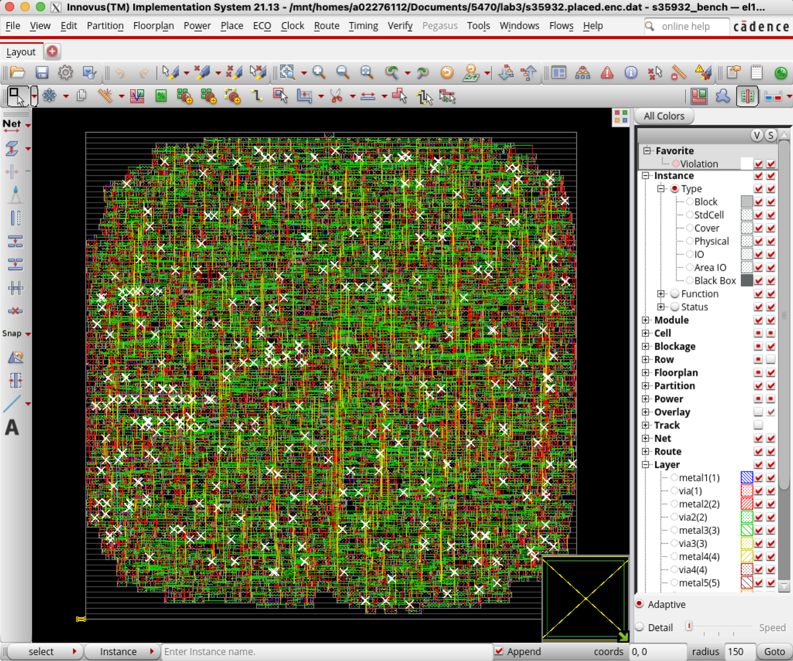

# Lab 4 | Nick Waddoups | ECE 5470

1. Global Routing (`globalRoute`)
   - Wire-length: 76704 um 
   - Vias: 29426
2. Detail Routing (`detailRoute`)
   - Wire-length: 84446 um
   - Vias: 36696
3. Slack:
   ```
   +--------------------+---------+---------+---------+
   |     Setup mode     |   all   | reg2reg | default |
   +--------------------+---------+---------+---------+
   |           WNS (ns):| -0.773  |  0.190  | -0.773  |
   |           TNS (ns):|-842.246 |  0.000  |-842.246 |
   |    Violating Paths:|  1636   |    0    |  1636   |
   |          All Paths:|  3488   |  1728   |  3488   |
   +--------------------+---------+---------+---------+
   ```
4. Screenshot:

   {width=80%}

Note: There are also results from Global Detail Routing (`globalDetailRoute`)
present, but I chose to write down the results for 1 and 2 from the specific
`detailRoute` and `globalRoute` commands, as opposed to the 
`globalDetailRoute` command.
