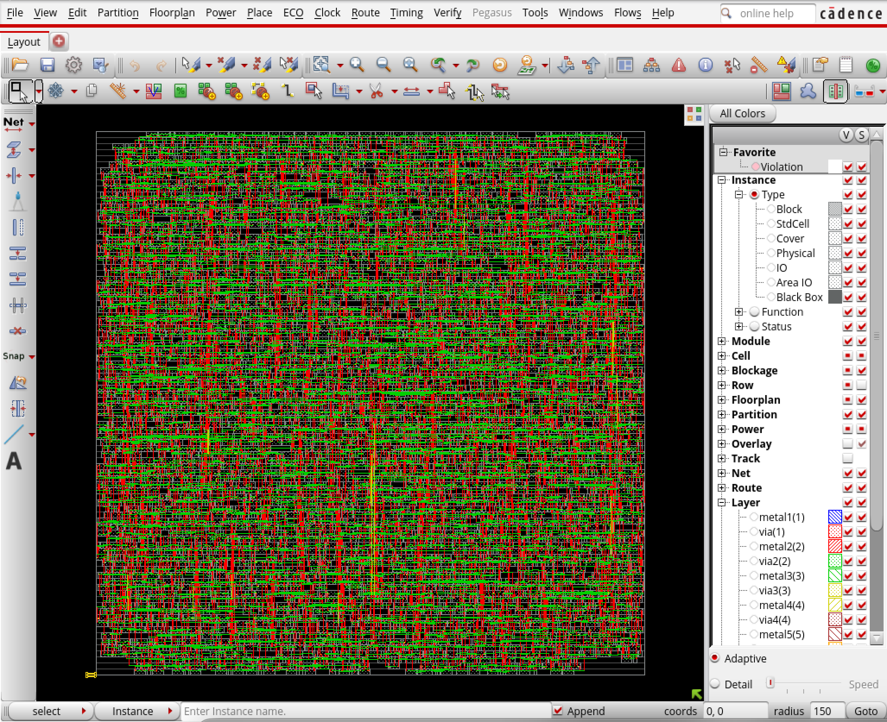
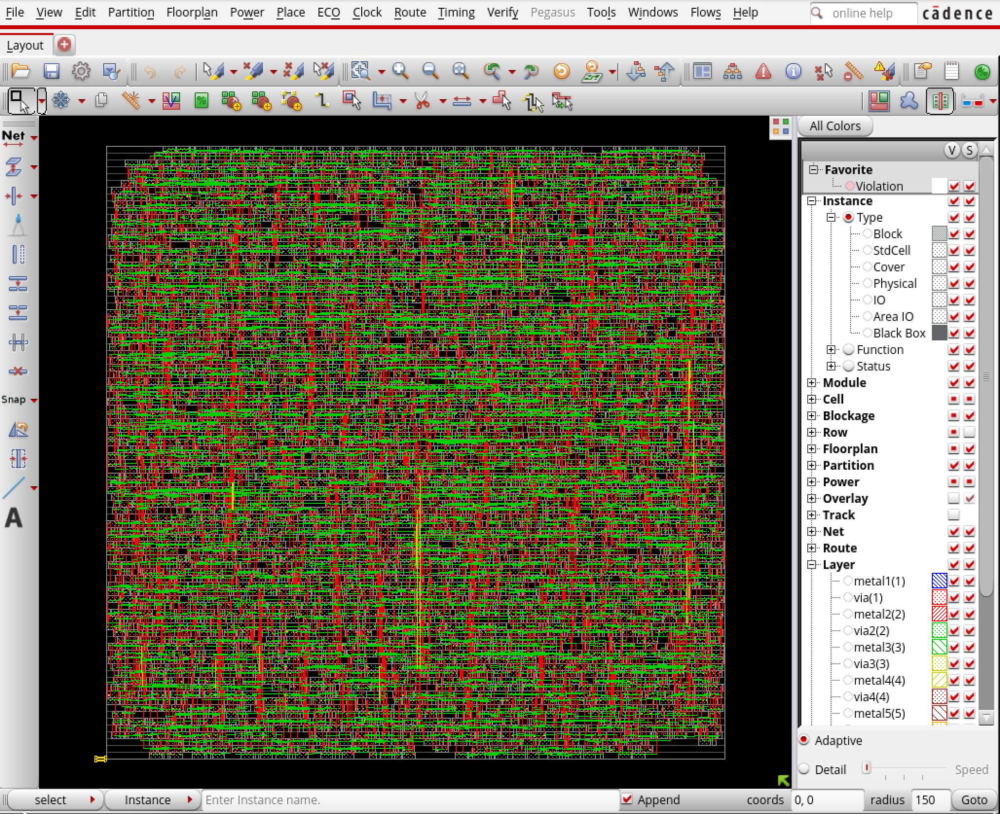

# Lab 3 - Nick Waddoups

## Part 1

- CPU time: 1:08.4 minutes
- Memory usage: 1.6 Gb
- Total net length: 4.749e+04 
- Worst negative slack: -6.091 ns

{width=80%}

## Part 2

- CPU time: 39.5 seconds
- Memory usage: 1.6 Gb
- Total net length: 4.749e+04 
- Worst negative slack: -6.091 ns (same as before...?)

{width=80%}

## Part 3

- CPU time: 1:02.6 minutes
- Memory usage: 1.6 Gb 
- Total net length: 4.749e+04
- Worst negative slack: -6.091 ns (same as before... `:(` )

{width=80%}

